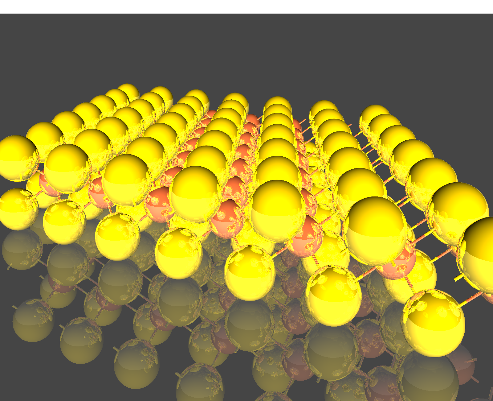

# Shiny Atoms with Ovito + POV-Ray

These are just some simple instructions for rendering publication-style images of crystal structures. Hopefully someone else will find them to be useful.

## Install POV-Ray

Mac (via Homebrew): `brew install povray`

Windows: download and run the installer from [here](https://www.povray.org/download/)

## Install Ovito
Download the version for your computer [here](https://www.povray.org/download/)

## Open the structure in Ovito and manipulate the scene
The most important part is getting the view angle you want, but ovito also makes it really easy to make a supercell, change atom colors, remove cell boundaries, add bonds, etc.

## Export POV-Ray file
file > Export File > select POV-Ray scene

## shinify the .pov file (something like this.. sorry for the ugly code):

```python
def shinify(input_filename, output_filename, specular=0.3, reflection=0.8, diffuse=0.9):

    lines = open(input_filename).readlines()
    with open(output_filename, "w") as f:
        i = 0
        while i < len(lines):
            line = lines[i]

            # Add better lighting
            # These lines will put a light fixture at the same location as the camera
            if line.split()[0] == "translate":
                light_x, light_y, light_z = line.split("<")[1].split(">")[0].split(",")
                light_z = str(float(light_z.strip()) + 0)

            # you can also mess with the color and its intensity
            if line.split()[0] == "light_source":
                f.write(
                    "light_source {\n"
                    + f"  <{light_x}, {light_y}, {light_z}>\n"
                    + "  color <1.2, 1.2, 1.2>\n"
                    + "}\n"
                )
                i += 6

            # Add shiny finish to spherical atoms
            elif line[0:14] == "#macro SPRTCLE":
                f.write(
                    "#macro SPRTCLE(pos, particleRadius, particleColor, spc, ref, dif) // Macro for spherical particles\n"
                    + "sphere { pos, particleRadius\n"
                    + "         texture { pigment { color particleColor } finish { specular spc reflection ref diffuse dif } }\n"
                    + "}\n#end\n"
                )
                i += 4
            elif line.split("(")[0] == "SPRTCLE":
                f.write(line.replace(")", f", {specular}, {reflection}, {diffuse})"))
            
            # Add shiny finish to cylindrical bonds
            elif line[0:10] == "#macro CYL":
                f.write(
                    "#macro CYL(base, dir, cylRadius, cylColor, spc, ref, dif) // Macro for cylinders\n"
                    + "cylinder { base, base + dir, cylRadius\n"
                    + "         texture { pigment { color cylColor } finish { specular spc reflection ref diffuse dif } }\n"
                    + "}\n#end\n"
                )
                i += 4
            elif line.split("(")[0] == "CYL":
                f.write(line.replace(")", f", {specular}, {reflection}, {diffuse})"))
            else:
                f.write(line)
            i += 1
```

## Finally, run `povray` on the new shiny .pov file
`povray +H800 +W800 +Iovito_file_shiny.pov +Oovito_file_shiny.png +UA`

+H & +W: image height and width in px. I usually go well into the 1000's for a final publication image, but ~800 is fast for testing.

+I & +O: povray filename and image filename, respectively

+UA: allow for transparency (alpha), I like it for creating clear .png files


