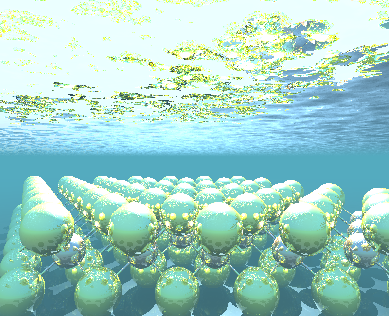

# Shiny Atoms with Ovito + POV-Ray

These are just some simple instructions for rendering publication-style images of crystal structures. Hopefully someone else will find them to be useful.

## 1. Install POV-Ray

Mac (via Homebrew): `brew install povray`

Windows: download and run the installer from [here](https://www.povray.org/download/)

## 2. Install Ovito
Download the version for your computer [here](https://www.povray.org/download/)

## 3. Open the structure in Ovito and manipulate the scene
The most important part is getting the view angle you want, but ovito also makes it really easy to make a supercell, change atom colors, remove cell boundaries, add bonds, etc.

## 4. Export POV-Ray file from Ovito
file > Export File > select POV-Ray scene

## 5. Add finishes to the .pov file (something like this.. sorry for the ugly code):

```python
def shinify(
    input_filename, output_filename, specular=0.8,
    reflection=0.8, diffuse=0.8, light_intensity=1,
    light_location=(None, None, None)
):

    """
    Adds finish properties to .pov output files generated from Ovito.
    
    args:
        input_filename (str): existing .pov file created by Ovito
        output_filename (str): desired filename for "shiny" .pov file
        specular, reflection, diffuse: finish parameters from POV-Ray, applied to spheres (atoms) and cylinders (bonds)
            see https://www.povray.org/documentation/view/3.6.1/79/ for more details/options.
        light_intensity (float): multiplier for light intensity
        light_location (tuple): x, y, and z coordinates of light fixture in the scene. You might have to use trial
            and error to find the best location if Ovito's default isn't what you want.
    """

    lines = open(input_filename).readlines()
    with open(output_filename, "w") as f:
        i = 0
        light_fixed = False
        while i < len(lines):
            line = lines[i]

            # Add your own lighting
            # you can also mess with the light color and its intensity
            if line.split()[0] == "light_source" and light_location[0] is not None:
                f.write(
                    "light_source {\n"
                    + f"  <{light_location[0]}, {light_location[1]}, {light_location[2]}>\n"
                    + "  color <{light_intensity}, {light_intensity}, {light_intensity}>\n"
                    + "}\n"
                )
                i += 6
                
            # Add shiny finish to spherical atoms
            if line[0:14] == "#macro SPRTCLE":
                f.write(
                    "#macro SPRTCLE(pos, particleRadius, particleColor, spc, ref, dif) // Macro for spherical particles\n"
                    + "sphere { pos, particleRadius\n"
                    + "         texture { pigment { color particleColor } finish { specular spc reflection ref diffuse dif } }\n"
                    + "}\n#end\n"
                )
                i += 4
            elif line.split("(")[0] == "SPRTCLE":
                f.write(line.replace(")", f", {specular}, {reflection}, {diffuse})"))
            
            # Add shiny finish to cylindrical bonds
            elif line[0:10] == "#macro CYL":
                f.write(
                    "#macro CYL(base, dir, cylRadius, cylColor, spc, ref, dif) // Macro for cylinders\n"
                    + "cylinder { base, base + dir, cylRadius\n"
                    + "         texture { pigment { color cylColor } finish { specular spc reflection ref diffuse dif } }\n"
                    + "}\n#end\n"
                )
                i += 4
            elif line.split("(")[0] == "CYL":
                f.write(line.replace(")", f", {specular}, {reflection}, {diffuse})"))
            else:
                f.write(line)
            i += 1

shinify("ovito_file.pov", "ovito_file_shiny.pov")
```

## 6. Run `povray` to render the new shiny .pov file
`povray +H800 +W800 +Iovito_file_shiny.pov +Oovito_file_shiny.png +UA`

+H & +W: image height and width in px. I usually go well into the 1000's for a final publication image, but ~800 is fast for testing.

+I & +O: povray filename and image filename, respectively

+UA: allow for transparency (alpha), I like it for creating clear .png files

## 7. Other tips/ideas

The y-axis in POV-Ray is generally "up", while z is generally "depth". For example, in the image below I also added a reflective plane under the atoms. I just added a line at the end of the shinify function:

```python
f.write("plane {<0, 1, 0>, 9 texture {pigment { color rgb <1, 1, 1> } finish { specular 0 reflection 0.2 diffuse 0.4}}}")
```

You can see that the plane is normal to the y-axis.

I also use a lot of trial and error for the lighting location and intensity, and for adding other objects (blocks, discs, etc.) to the scene.


You will have to consult [the POV-Ray documentation](http://www.povray.org/documentation/) for all the possible things you can add and change- it goes WAY beyond what I've achieved in this small example. There is also quite a large community of POV-Ray expert users creating example scripts that you should make liberal use of. For example, I just buried the above ovito atoms scene in an underwater scene I found [here](http://news.povray.org/povray.text.scene-files/message/%3C3920ff12%40news.povray.org%3E/) to get the image below:


